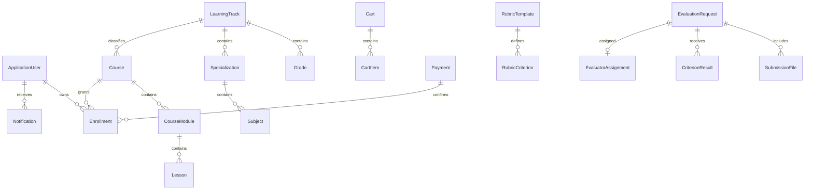

# BETCCO data model

Sensitive IDs use UUIDs. Unique indexes cover slugs, cart owner keys, enrollment `(student, course)`, progress `(student, lesson)`, coupons, payment idempotency/provider references, and webhook events. Financial and audit records are retained; they are not soft-deleted or overwritten. The initial migration also configures identity tables, settings, support, notifications, and private uploads.
